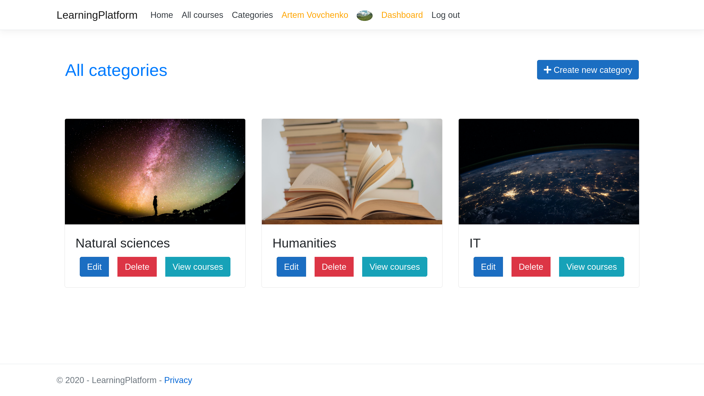
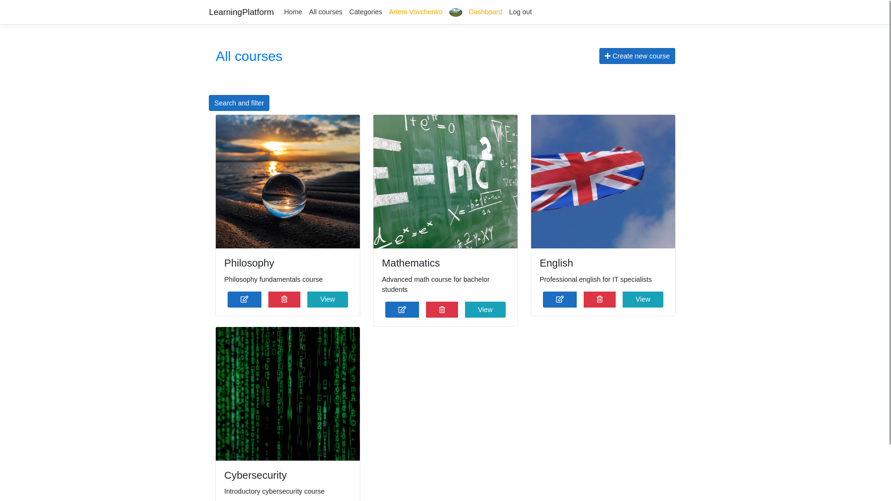
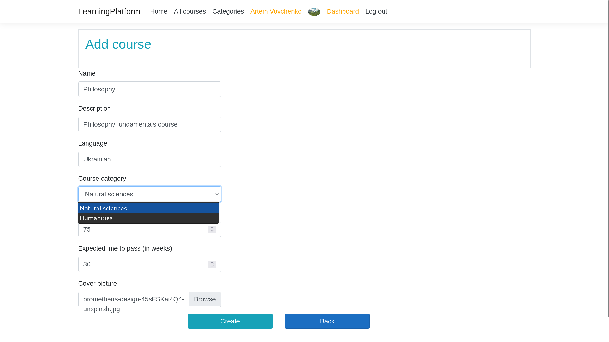
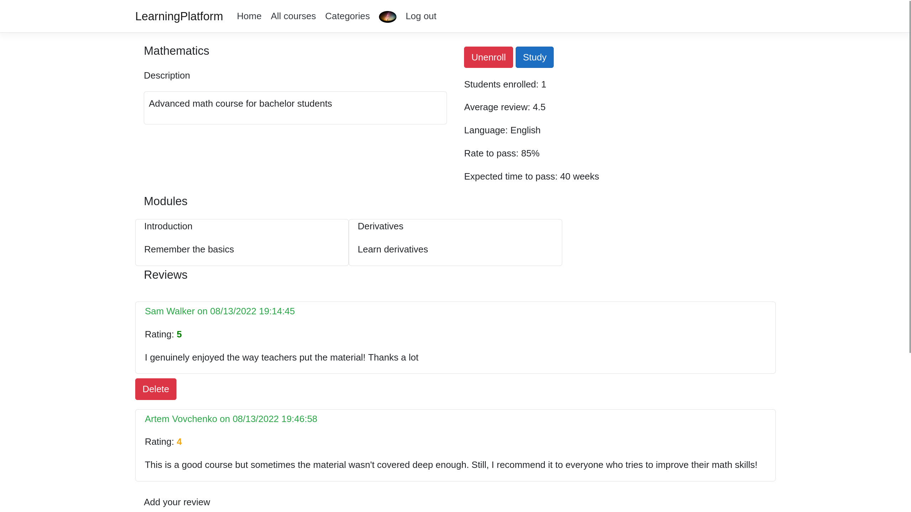
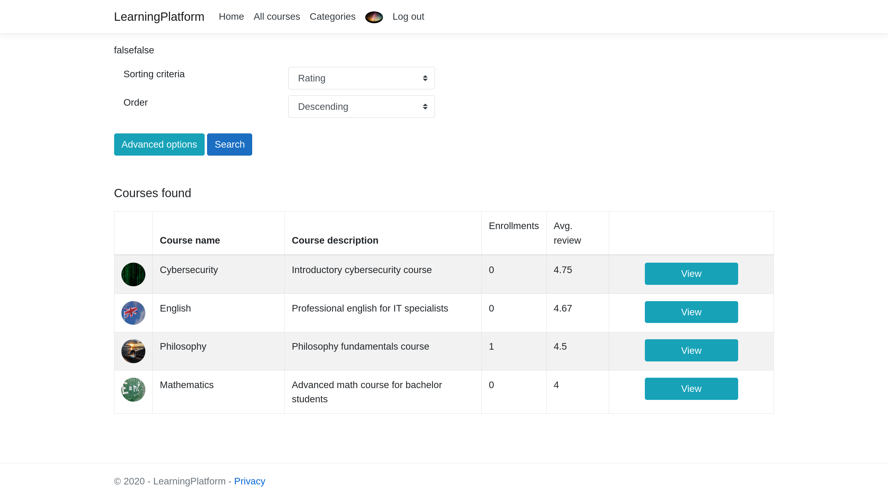
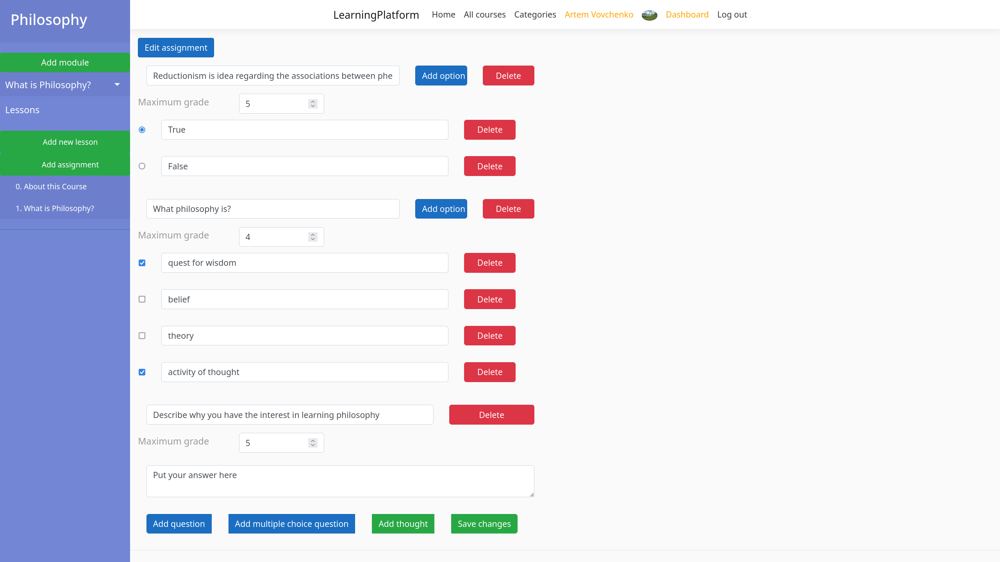
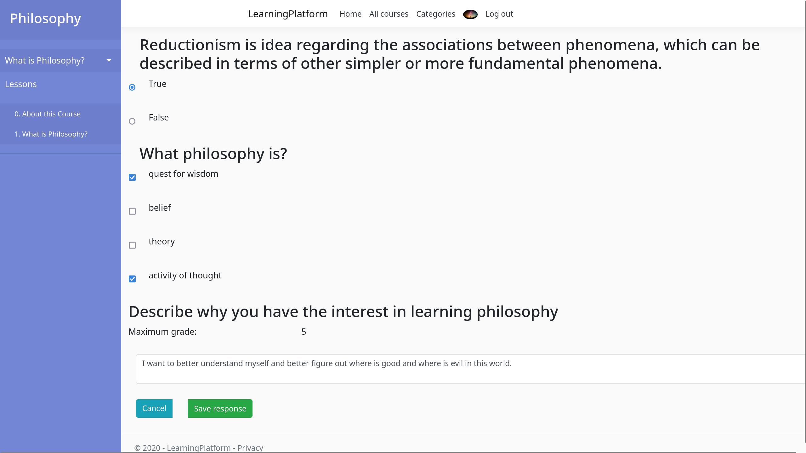
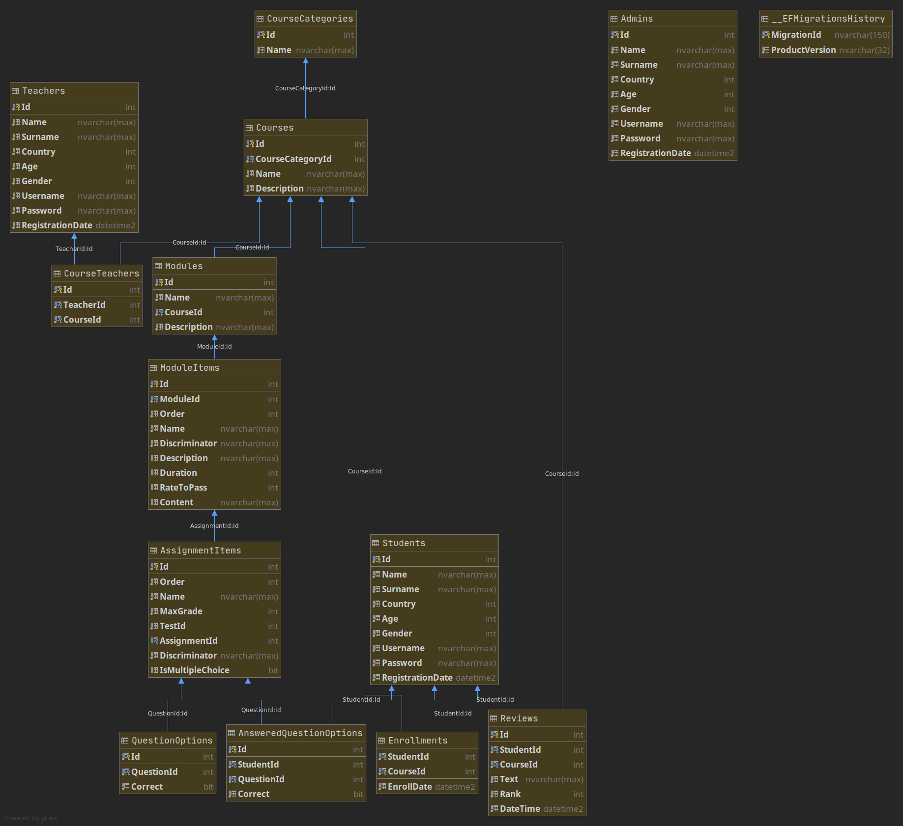

# Description

This is my .NET Web MVC project in KPI, 2d course.

It's a simple website, where the administrator can create online learning courses, and students can enroll for them, study the materials and work with quiz assignments.

More complete list of features includes:
* creation of user profiles
* registration and login functionality
* creation of course categories and courses
* editing and deleting of any entity
* profiles, courses and course categories have picture covers associated with them
* ability to sort courses by different parameters
* students can leave reviews on courses
* ability to create and fill quizzes with single and multiple choice questions and free thought questions
* ability to view courses only from the specific category
* admin page with ability to serialize and restore the database

# Technologies

This project uses the following technologies:
* .NET Core 3.1 platform using C# language
* Entity Framework Core
* Database generation using code-first approach
* Data storage in MSSQL database
* Dependency injection
* 3-tier architecture with following layers: Models - Services - ViewModels - Views
* EntityFramework's DbSets as repositories
* docker and docker-compose for the ability to quickly spin up the website with the database

# How to run

In order to be able to start the project this way, you need docker and docker-compose to be installed on your system.

Go to the `docker` directory and run the following:

```
docker-compose up -d
```

Now, the website frontend will be accessible on this address:
```
http://localhost:8080/
```

# Tips

To create admin account, register a profile with username `admin`

The connection string to the database is stored in [appsettings.json](./LearningPlatform/appsettings.json)

Script which is used to create database structure: [script.sql](./docker/script.sql)

# Screenshots















# Database structure



